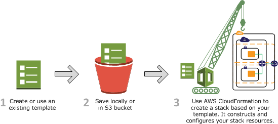
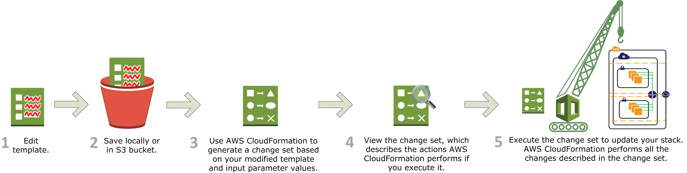

# Introdução ao AWS CloudFormation

Este documento apresenta, de forma breve e prática, o **AWS CloudFormation**, um serviço da AWS usado para criar e gerenciar recursos de infraestrutura como código (IaC).

---

## O que é o AWS CloudFormation

O AWS CloudFormation permite descrever recursos da AWS em arquivos chamados **templates**, escritos em JSON ou YAML. Com isso, você consegue provisionar ambientes de forma padronizada, repetível e automatizada.

Em vez de criar recursos manualmente no console, você define tudo como código e o CloudFormation cuida da criação, atualização e remoção da infraestrutura.

---

## Para que serve

- Automatizar a criação de ambientes na AWS.
- Garantir padronização entre desenvolvimento, teste e produção.
- Versionar a infraestrutura junto com o código da aplicação.
- Facilitar a reprodução e o controle de mudanças.

---

## Conceitos básicos

- **Template:** arquivo que descreve os recursos desejados.
- **Stack:** conjunto de recursos criado a partir de um template.
- **Change Set:** prévia das alterações que serão aplicadas em uma stack.
- **Parameters:** valores que podem ser informados ao reutilizar o template.
- **Outputs:** informações retornadas após a criação da stack, como endpoints e IDs.

---

## Exemplo simples

Um template pode criar recursos como:

- uma instância EC2;
- um bucket S3;
- uma role IAM;
- uma fila SQS.

Assim, toda a infraestrutura pode ser recriada com consistência em poucos comandos.

---

## Vantagens

- Reduz erros de configuração manual.
- Aumenta a reprodutibilidade dos ambientes.
- Facilita auditoria e controle de versão.
- Ajuda a aplicar boas práticas de infraestrutura como código.

---

## Quando usar

Use CloudFormation quando quiser provisionar recursos da AWS de forma automatizada, organizada e rastreável, especialmente em projetos que exigem ambientes consistentes e bem documentados.

---

## Links úteis

- Documentação oficial: https://docs.aws.amazon.com/cloudformation/
- Guia de templates: https://docs.aws.amazon.com/AWSCloudFormation/latest/UserGuide/template-guide.html

---

## Conclusão

O AWS CloudFormation é uma ferramenta essencial para quem quer tratar infraestrutura como código na AWS. Ele simplifica a criação e a manutenção de ambientes, deixando o processo mais seguro, escalável e padronizado.

